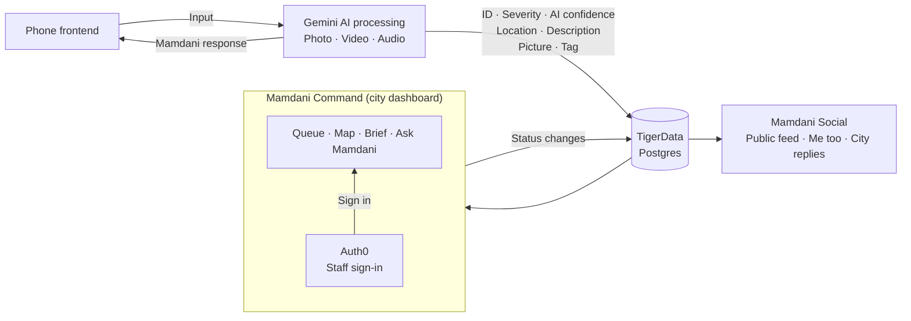

# Mamdani

Report civic problems with a photo and a conversation. An animated inspector helps residents describe the issue, presents the result, and lets them follow its status.

**Live:** resident app API at [mamdani.vercel.app](https://mamdani.vercel.app) · city dashboard at [mamdani-command.vercel.app](https://mamdani-command.vercel.app) · public feed at [mamdani-social.vercel.app](https://mamdani-social.vercel.app)

## One loop between residents and City Hall

Today a resident who spots a broken sidewalk has to find the right 311 form, pick a category they don't know, describe it in words, and then hear nothing back. On the other side, the city gets a pile of vague, duplicated tickets with no photo, no location precision and no sense of what matters most.

NYC Mayor Zohran Mamdani showed another way: meet residents on the street, on camera, and answer in public. It works because everyone can see it. When a problem is visible, neighbours pile on, and the people in charge have a reason to respond.

Mamdani closes that loop from both ends, in the open:

1. **A resident points their phone and talks.** Mamdani (Gemini Live) looks at the problem, asks what he needs to, and takes the evidence photo himself. No forms, no categories to guess.
2. **Gemini turns it into a work order the city can act on:** what it is, how severe, how dangerous, whether it blocks a wheelchair, which department owns it, and exactly where. Faces and plates are blurred before anything is stored.
3. **Duplicates collapse into one issue.** Ten people reporting the same pothole become one work order with ten confirmations, matched by location and by what the photos show (Gemini embeddings in Tiger Data's pgvector). Every confirmation raises its priority.
4. **The neighbourhood backs it up in public.** The report becomes a post on Mamdani Social: the photo, the resident's own words and Gemini's summary. Neighbours tap "Me too" and comment that it affects them too.
5. **The city sees it seconds later in Mamdani Command,** ranked, mapped, costed and routed to the right crew.
6. **Every status change goes back to the resident and out to the public.** "Crew assigned", "being fixed", "fixed" show up in the resident's app and as the City's reply under the post. Anything Mamdani tells a resident is checked against the city's record first.

The resident gets heard. The neighbourhood sees it's not just them. The city gets clean, deduplicated, prioritized data instead of noise, and a public reason to act. Everyone looks at the same record.

## Mamdani Command: the city's side

**Who it's for:** the people who actually fix the city. Operations supervisors deciding what crews do today, engineers and inspectors triaging hazards, dispatchers planning runs, and councillor offices that need to answer "what's happening on my streets?" in seconds.

**What it does:**

- **Tells you what matters first.** Every issue gets a priority out of 100 that you can open up and read: severity, safety risk, accessibility impact, how many residents reported it, and how long it has waited. Nothing is a black box.
- **Holds the city to its promises.** Every open issue runs a clock against its service target (tighter for safety hazards). Late and at-risk work is flagged before it becomes a complaint.
- **Puts it all on a live map.** A 3D map of Ottawa with every open issue, a heat layer of where residents are reporting, and a 7-day replay that shows where problems cluster over time.
- **Plans the crew's day.** Pick stops (or ask Mamdani) and it orders them into the shortest run from the Public Works yard, drives it on real roads, and gives you a manifest to send the crew. Nearby issues can be batched into one visit.
- **Writes the work plan.** For any issue, Gemini chooses the crew, hours, equipment and materials; the cost is then worked out line by line from documented planning rates ([`lib/rates.ts`](lib/rates.ts)). The plan also covers the steps, traffic control, and what happens if it waits, and includes a plain-language update for the residents who reported it. Dollar claims about delay only appear when a cited source backs them.
- **Briefs you every morning.** Gemini reads the whole record and checks the weather and conditions with Google Search, then writes the day's memo: what changed, the five things to do first and why, which crew goes where, and what to watch. Mamdani will read it to you.
- **Answers questions like a colleague.** Ask Mamdani, the 3D inspector in the corner, anything: "Which accessibility barriers are past target in Centretown?", "Plan a route for the worst road jobs", "Find photos that look like flooding at a crosswalk". He answers from the live record in Tiger Data, cites outside sources when he uses the web, highlights what he's talking about on the map, and proposes changes that a person confirms. He never edits the record on his own.
- **Shows who is waiting longest.** Analytics break the backlog down by department, time of day and neighbourhood, so the city can see whether some areas wait longer or carry more accessibility barriers than others.
- **Stays live.** New resident reports appear within seconds, with a notification and Mamdani calling them out.

The dashboard lives in [`dashboard/`](dashboard/README.md) (Vite + React, GSAP, Mapbox, and the same 3D Mamdani as the phone). Its Gemini features run in the Next API under [`lib/command/`](lib/command).

## Mamdani Social: the public side

**Who it's for:** everyone else. Neighbours who walk past the same pothole every day, people who want to know whether anyone is doing anything about it, and the city staff (and mayor) who want to be seen responding.

**What it does:**

- **Every report is a post.** Each report filed with a photo appears in a public feed: the resident's photo, what they told Mamdani, and Gemini's summary, with the category and where it is.
- **Complaints come together.** Each post shows how many neighbours reported the same problem through the app: the issue's confirmations, the same number that raises its priority on the city dashboard, so community support moves it up the crew's queue. People can add their own "Me too" and comments right in the feed.
- **The city answers in public.** As a work order moves from assigned to being fixed to fixed, the City of Ottawa's reply appears under the post, with the department handling it.
- **It stays live.** New reports appear within seconds, and the "fixed" count keeps score.

It's the Mamdani cycle: a resident raises something, the community backs it up, the city responds where everyone can see, and everyone sees it get fixed.

The web feed is served by the dashboard app ([`dashboard/src/social/`](dashboard/src/social)) at `/feed` and as its own site, with no sign-in. In the phone app it's a second tab (Report · Feed), built on the `fullapptest` branch of [leo-mitch/mamdani-mobile](https://github.com/leo-mitch/mamdani-mobile/tree/fullapptest). Accounts aren't built yet: posts are credited to the team's four names by work-order number, and "Me too"s and comments added in the feed stay on that device.

## Architecture

Reporting flow: the phone frontend sends photos, video, and audio to Gemini. Gemini responds as Mamdani and prepares structured issue data for TigerData Postgres. The government dashboard (Auth0 sign-in) and the public feed both read those records, and status changes flow back to the resident and the feed.



## Models and responsibilities

Model roles and their implementation on `main` are listed below. The Gemini IDs are code defaults from [the AI configuration](lib/ai.ts) and [Live setup](lib/live.ts); the listed environment variables override them.

| Model | Role | Environment override | Current implementation |
| --- | --- | --- | --- |
| `gemini-3.8-live` | Runs Mamdani's mobile conversation: sees camera frames, hears microphone audio, streams spoken replies and transcripts, and calls `report_issue` when ready to capture evidence. | `GEMINI_LIVE_MODEL` | [Live setup](lib/live.ts), [mobile client](mobile/src/live/client.ts) |
| `gemini-3.8-flash` | Analyzes the evidence photo, optional short video, and conversation context. Produces the issue category, description, severity, safety risk, accessibility impact, confidence, bounding box, and any clarification question. Also chooses Mamdani's response, outfit, emotion, prop, and animation. | `GEMINI_MODEL` | [Report analysis](lib/analyze.ts), [submission pipeline](lib/submit.ts) |
| `gemini-3.5-flash-lite` | Screens photos and locates faces and licence plates for pixelation; compares two photos when duplicate matching needs a visual check; checks answers against saved report facts when Check Grounding is unavailable and rewrites unsupported answers. | `GEMINI_LITE_MODEL` | [Photo screening](lib/screen.ts), [duplicate matching](lib/intake.ts), [answer verification](lib/verify.ts) |
| `gemini-embedding-2` | Converts evidence photos into normalized 768-dimensional vectors. Similarity comparisons help match nearby reports of the same physical issue, and staff can search the evidence by describing it in words on the dashboard. | `GEMINI_EMBED_MODEL` | [Image embeddings](lib/ai.ts), [duplicate matching](lib/intake.ts) |
| `gemini-3.8-flash` (Command) | Powers the dashboard: Ask Mamdani's streamed tool-calling agent over the city record, the daily brief, and per-issue work plans (crew, cost range, resident update). | `GEMINI_AGENT_MODEL`, `GEMINI_MODEL` | [Agent](lib/command/agent.ts), [brief](lib/command/brief.ts), [work plans](lib/command/assist.ts) |
| Google Search grounding | Outside facts for staff (weather, standards, typical costs) with cited sources, used by Ask Mamdani and the daily brief. | None | [Research](lib/command/research.ts) |
| `gemini-2.5-flash-tts` | Mamdani's voice on the dashboard (the same Orus voice as the phone); his 3D mouth follows the audio. | `GEMINI_TTS_MODEL` | [Speech route](app/api/speak/route.ts) |
| Lyria | Generates the waiting music played while Mamdani gets ready and the report is processed. | None; the generated audio is bundled with the app. | [Capture flow](mobile/src/CaptureScreen.tsx) loads [the music loop](mobile/assets/audio/wait-loop.wav); [audio playback](mobile/src/live/audio.ts) loops and fades it. |
| ShieldGemma 2 | Intended model for checking whether submitted content is appropriate. | Not configured on `main`. | No ShieldGemma 2 integration is present in the current code; [photo screening](lib/screen.ts) still calls Flash-Lite. |

[`.env.example`](.env.example) currently sets `GEMINI_MODEL=gemini-2.5-flash`. Copying that value into the runtime environment selects **2.5 Flash for report analysis**, overriding the **3.8 Flash** code default above.

Answer verification first tries **Vertex AI Check Grounding**, a separate service rather than another selectable Gemini model. Live speech uses the `Orus` voice by default (`GEMINI_LIVE_VOICE` overrides it); web speech uses the browser's speech synthesis, and mobile has an `expo-speech` fallback.

For offline character asset preparation, [the Tripo helper](scripts/tripo.ts) uses `v3.1-20260211` for image-to-3D generation and `v1.0-20240301` for biped rigging. These run during asset preparation; the app's AI interaction uses the Gemini models above.

## What it does

- Analyzes photos to identify the problem, severity, safety risk, accessibility impact, and responsible department label.
- Matches nearby reports using location and photo similarity to group the same physical issue.
- Stores evidence and reports, calculates issue priority, and lets residents check report status.
- Animates the inspector and speaks the result; mobile supports live conversation and checks follow-up answers against the saved issue.

## Run the web app

```sh
npm install
npm run dev
```

Open [localhost:3000](http://localhost:3000). Use `.env.example` as a starting point for `.env.local` when configuring services. Without database and AI credentials, the app uses seeded memory storage and demo analysis. Live conversation requires Google Cloud credentials for Gemini Live; browser speech needs no separate service credentials.

To run the city dashboard and the public feed alongside it (with the API above running on port 3000):

```sh
cd dashboard
npm install
npm run dev
```

Open [localhost:5173](http://localhost:5173) and sign in with Auth0; the dashboard lives under `/admin/`, and the public feed is at [localhost:5173/feed](http://localhost:5173/feed) with no sign-in. It needs `VITE_MAPBOX_ACCESS_TOKEN`, `VITE_AUTH0_DOMAIN` and `VITE_AUTH0_CLIENT_ID` in `dashboard/.env`; see [the dashboard README](dashboard/README.md). To fill Tiger Data with a realistic month of Ottawa reports for a demo, run `npx tsx scripts/demo-city.ts` (`--remove` takes it out again, `--pulse` files one live report so you can watch the dashboard react).

See [mobile setup](mobile/README.md) for the Expo app and [architecture and data flows](docs/architecture.md) for API contracts, database details, and workflow behavior.
