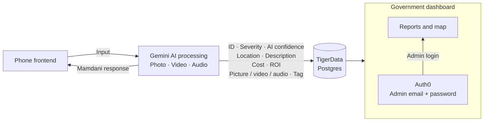

# Mamdani

Report civic problems with a photo and a conversation. An animated inspector helps residents describe the issue, presents the result, and lets them follow its status.

## Architecture

Target reporting flow: the phone frontend sends photos, video, and audio to Gemini. Gemini responds as Mamdani and prepares structured issue data for TigerData Postgres. The government dashboard reads those reports, with admin access through Auth0.



## What it does

- Analyzes photos to identify the problem, severity, safety risk, accessibility impact, and responsible department label.
- Matches nearby reports using location and photo similarity to group the same physical issue.
- Stores evidence and reports, calculates issue priority, and lets residents check report status.
- Animates the inspector and speaks the result; mobile supports live conversation and checks follow-up answers against the saved issue.

## Run the web app

```sh
npm install
npm run dev
```

Open [localhost:3000](http://localhost:3000). Use `.env.example` as a starting point for `.env.local` when configuring services. Without database and AI credentials, the app uses seeded memory storage and demo analysis. Live conversation requires Google Cloud credentials for Gemini Live; browser speech needs no separate service credentials.

See [mobile setup](mobile/README.md) for the Expo app and [architecture and data flows](docs/architecture.md) for API contracts, database details, and workflow behavior.
