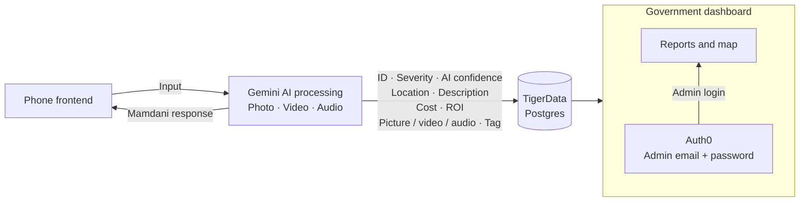

# Mamdani

Report civic problems with a photo and a conversation. An animated inspector helps residents describe the issue, presents the result, and lets them follow its status.

## Architecture

Target reporting flow: the phone frontend sends photos, video, and audio to Gemini. Gemini responds as Mamdani and prepares structured issue data for TigerData Postgres. The government dashboard reads those reports, with admin access through Auth0.



## Models and responsibilities

Model roles and their implementation on `main` are listed below. The Gemini IDs are code defaults from [the AI configuration](lib/ai.ts) and [Live setup](lib/live.ts); the listed environment variables override them.

| Model | Role | Environment override | Current implementation |
| --- | --- | --- | --- |
| `gemini-3.8-live` | Runs Mamdani's mobile conversation: sees camera frames, hears microphone audio, streams spoken replies and transcripts, and calls `report_issue` when ready to capture evidence. | `GEMINI_LIVE_MODEL` | [Live setup](lib/live.ts), [mobile client](mobile/src/live/client.ts) |
| `gemini-3.8-flash` | Analyzes the evidence photo, optional short video, and conversation context. Produces the issue category, description, severity, safety risk, accessibility impact, confidence, bounding box, and any clarification question. Also chooses Mamdani's response, outfit, emotion, prop, and animation. | `GEMINI_MODEL` | [Report analysis](lib/analyze.ts), [submission pipeline](lib/submit.ts) |
| `gemini-3.5-flash-lite` | Screens photos and locates faces and licence plates for pixelation; compares two photos when duplicate matching needs a visual check; checks answers against saved report facts when Check Grounding is unavailable and rewrites unsupported answers. | `GEMINI_LITE_MODEL` | [Photo screening](lib/screen.ts), [duplicate matching](lib/intake.ts), [answer verification](lib/verify.ts) |
| `gemini-embedding-2` | Converts evidence photos into normalized 768-dimensional vectors. Similarity comparisons help match nearby reports of the same physical issue. | `GEMINI_EMBED_MODEL` | [Image embeddings](lib/ai.ts), [duplicate matching](lib/intake.ts) |
| Lyria | Generates the waiting music played while Mamdani gets ready and the report is processed. | None; the generated audio is bundled with the app. | [Capture flow](mobile/src/CaptureScreen.tsx) loads [the music loop](mobile/assets/audio/wait-loop.wav); [audio playback](mobile/src/live/audio.ts) loops and fades it. |
| ShieldGemma 2 | Intended model for checking whether submitted content is appropriate. | Not configured on `main`. | No ShieldGemma 2 integration is present in the current code; [photo screening](lib/screen.ts) still calls Flash-Lite. |

[`.env.example`](.env.example) currently sets `GEMINI_MODEL=gemini-2.5-flash`. Copying that value into the runtime environment selects **2.5 Flash for report analysis**, overriding the **3.8 Flash** code default above.

Answer verification first tries **Vertex AI Check Grounding**, a separate service rather than another selectable Gemini model. Live speech uses the `Orus` voice by default (`GEMINI_LIVE_VOICE` overrides it); web speech uses the browser's speech synthesis, and mobile has an `expo-speech` fallback.

For offline character asset preparation, [the Tripo helper](scripts/tripo.ts) uses `v3.1-20260211` for image-to-3D generation and `v1.0-20240301` for biped rigging. These run during asset preparation; the app's AI interaction uses the Gemini models above.

## What it does

- Analyzes photos to identify the problem, severity, safety risk, accessibility impact, and responsible department label.
- Matches nearby reports using location and photo similarity to group the same physical issue.
- Stores evidence and reports, calculates issue priority, and lets residents check report status.
- Animates the inspector and speaks the result; mobile supports live conversation and checks follow-up answers against the saved issue.

## Run the web app

```sh
npm install
npm run dev
```

Open [localhost:3000](http://localhost:3000). Use `.env.example` as a starting point for `.env.local` when configuring services. Without database and AI credentials, the app uses seeded memory storage and demo analysis. Live conversation requires Google Cloud credentials for Gemini Live; browser speech needs no separate service credentials.

See [mobile setup](mobile/README.md) for the Expo app and [architecture and data flows](docs/architecture.md) for API contracts, database details, and workflow behavior.
